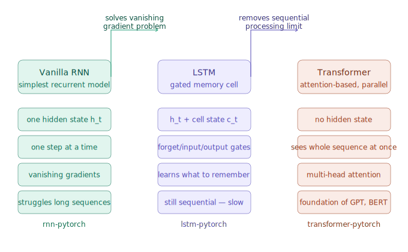
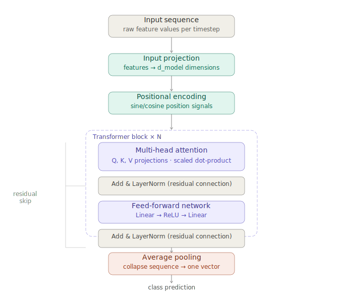
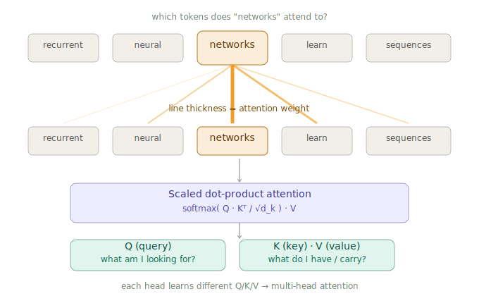

# Transformer from Scratch using PyTorch

A clean, fully commented implementation of the **Transformer architecture** built manually in PyTorch, no `nn.Transformer` used, built block by block to show exactly how attention works.

The Transformer is the foundation of modern AI: GPT, BERT, and every large language model builds on this architecture.

## The Core Idea

Unlike RNNs that process tokens one by one, the Transformer looks at the **entire sequence at once**. Each token asks: *"which other tokens should I pay attention to?"*

```
score(token_i, token_j) = (Q_i · K_j) / sqrt(d_k)
```

- **Q** (Query) — what am I looking for?
- **K** (Key)   — what do I contain?
- **V** (Value) — what information do I carry?

High score = pay more attention. The output is a weighted sum of Values.

## Architecture — Built Block by Block

```
Input features
      ↓
Linear projection → d_model dimensions
      ↓
Positional Encoding    ← tells the model where each token is
      ↓
┌─────────────────────────────────┐
│      Transformer Block × N      │
│                                 │
│  Multi-Head Attention           │
│  + Residual + LayerNorm         │
│                                 │
│  Feed-Forward Network           │
│  + Residual + LayerNorm         │
└─────────────────────────────────┘
      ↓
Average pooling across timesteps
      ↓
Linear → class prediction
```
## Visual diagrams

### Model progression — RNN → LSTM → Transformer


### Internal architecture


### Attention mechanism

## Project Structure

```
transformer-pytorch/
├── transformer.py   # Full implementation + training script
├── sample_data.csv  # Example CSV to test immediately
├── requirements.txt # Dependencies
└── README.md
```

## How to Run

```bash
# Install dependencies
pip install -r requirements.txt

# Train on the included sample data
python transformer.py --data sample_data.csv --target target_class

# Train on CSV
python transformer.py --data your_file.csv --target label_column

# Run demo mode (no CSV needed)
python transformer.py
```

## All Options

| Argument | Default | Description |
|----------|---------|-------------|
| `--data` | None | Path to your CSV file |
| `--target` | None | Column name with class labels |
| `--seq_len` | 10 | Sequence length |
| `--d_model` | 32 | Model dimension |
| `--num_heads` | 4 | Number of attention heads |
| `--num_layers` | 2 | Number of Transformer blocks |
| `--epochs` | 50 | Training epochs |
| `--batch_size` | 32 | Batch size |
| `--lr` | 0.001 | Learning rate |

## CSV Format

 CSV should have feature columns and one target column with class labels (integers or strings):

```
feature1, feature2, feature3, ..., target_class
0.52,     -0.31,    0.88,    ..., 0
0.11,      0.74,   -0.22,    ..., 1
...
```

## Key Implementation Details

- `PositionalEncoding` uses sine/cosine waves to inject position information
- `SingleHead` computes Q, K, V projections and scaled dot-product attention manually
- `MultiHeadAttention` runs multiple heads in parallel and combines their outputs
- `FeedForward` processes each token independently after attention
- `TransformerBlock` wraps both sublayers with residual connections and LayerNorm
- Cosine annealing learning rate scheduler for smooth convergence
- Reports both loss and accuracy during training

## Related Projects

- [lstm-pytorch](https://github.com/Nilthd/lstm-pytorch) — LSTM with forget/input/output gates
- [RNN-pytorch](https://github.com/Nilthd/RNN-pytorch) — Vanilla RNN, the simplest recurrent model

## Author

Niloofar Tavahoodi — M.A.Sc. Candidate, Electrical & Computer Engineering, University of Victoria
